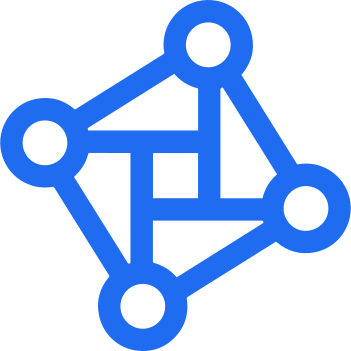

= Relaton branding

Branding assets for the Relaton project.

== Logo

.Relaton logo in SVG

== Colors

The official Relaton colors are shown in the table below.

.Relaton color palette
|===
|Color name |Pantone code |CMYK |RGB |Hex

|Bilateral Ocean
|Pantone 2726 C
|CMYK 80 / 60 / 0 / 0
|RGB 31 / 108 / 241
|`#1f6cf1`

|Suspicious Aqua
|Pantone 3385 C
|CMYK 71 / 0 / 55 / 0
|RGB 33 / 193 / 151
|`#21c197`

|Dazed Aqua
|Pantone 7724 C
|CMYK 86 / 22 / 75 / 7
|RGB 0 / 138 / 100
|`#008a64`

|Steamed Tar 01
|Pantone Black 433 C
|CMYK 78 / 68 / 60 / 71
|RGB 28 / 33 / 38
|`#1c2126`

|Steamed Tar 02
|Pantone Black 433 C 70%
|CMYK 78 / 68 / 60 / 71 * 0.7
|RGB 28 / 33 / 38 * 0.7
|`#1c2126`

|Steamed Tar 03
|Pantone Black 433 C 40%
|CMYK 78 / 68 / 60 / 71 * 0.4
|RGB 28 / 33 / 38 * 0.4
|`#1c2126`

|Steamed Tar 04
|Pantone Black 433 C 10%
|CMYK 78 / 68 / 60 / 71 * 0.1
|RGB 28 / 33 / 38 * 0.1
|`#1c2126`
|===

== License

Copyright Ribose. All rights reserved.

